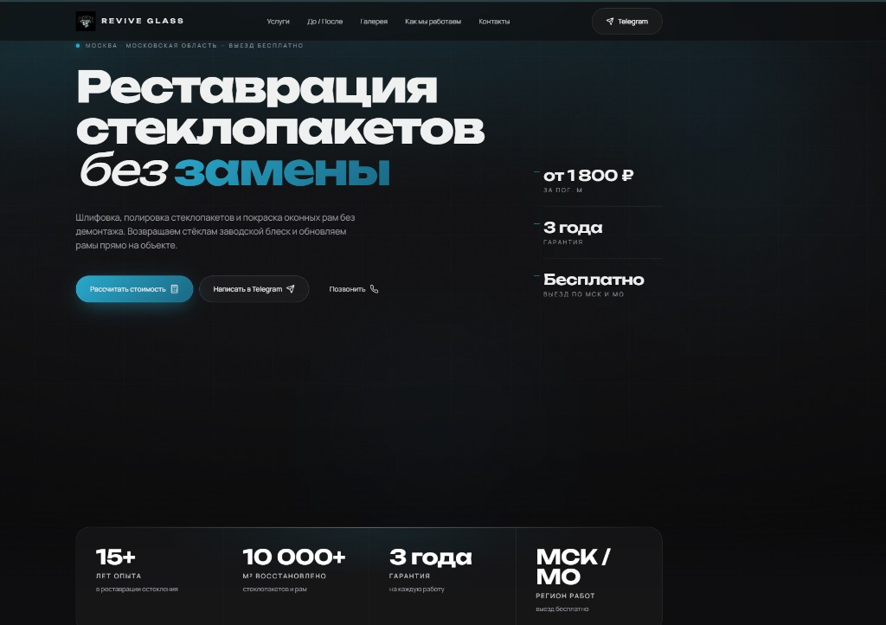
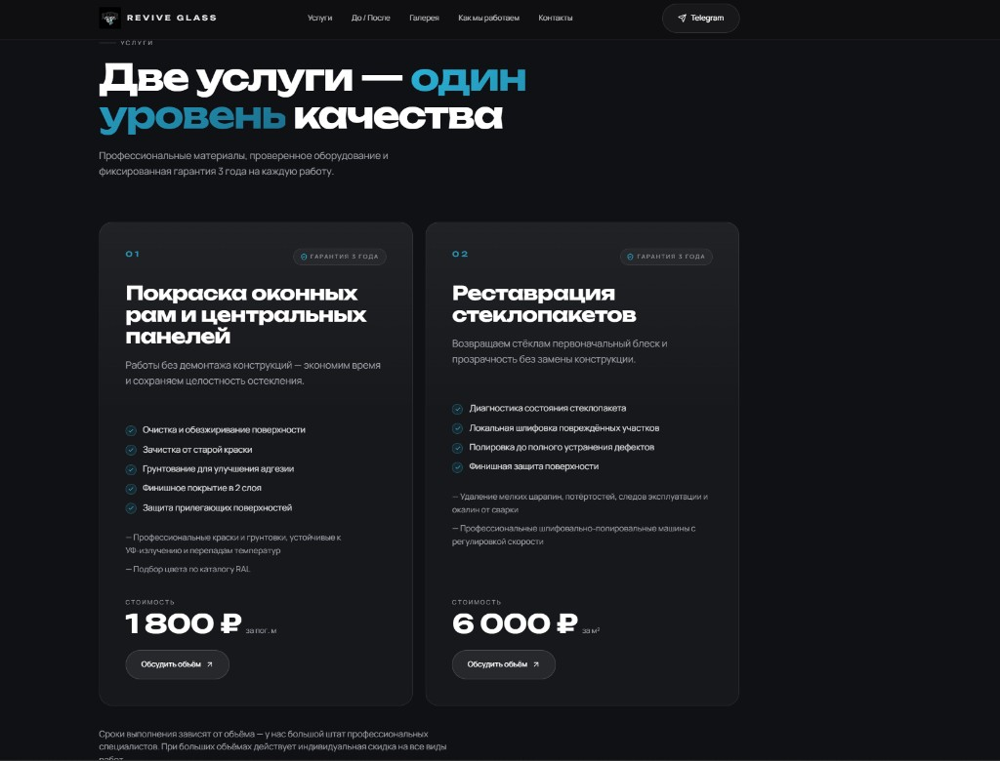
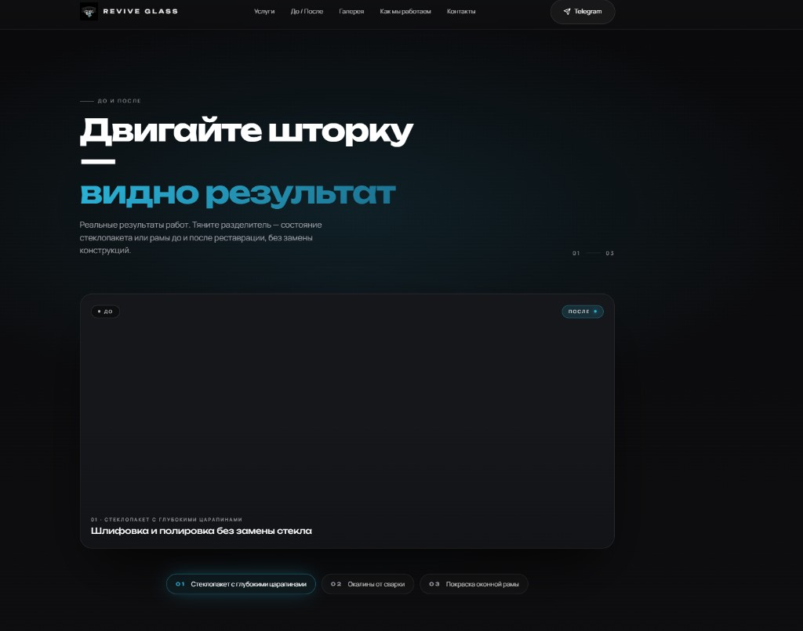
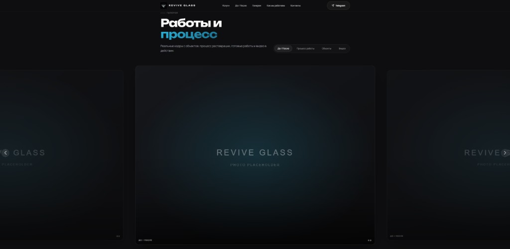
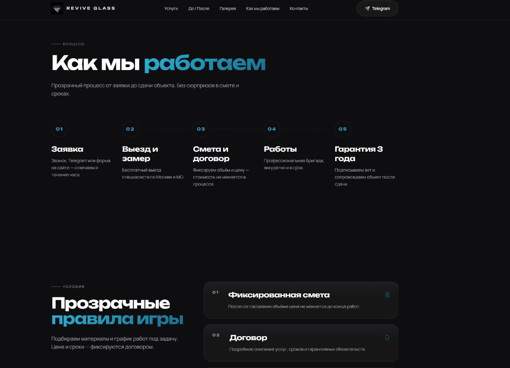
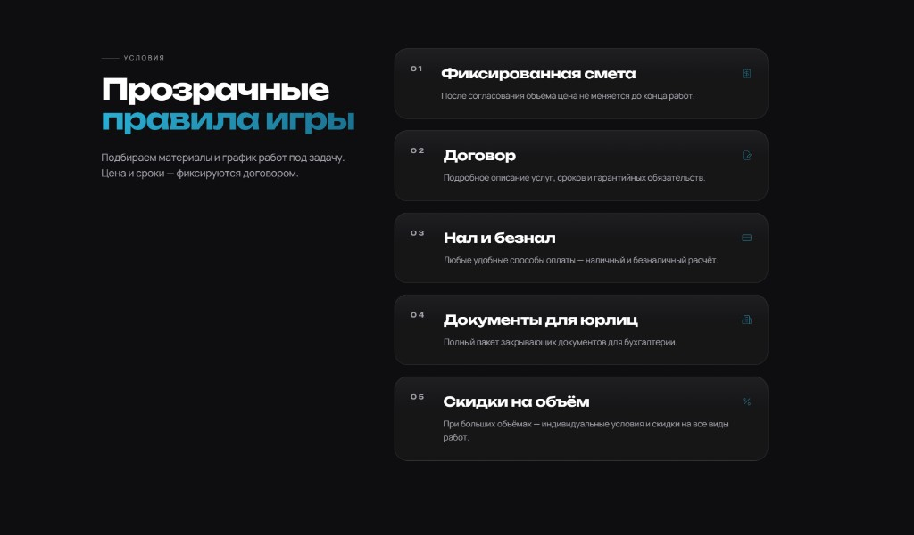
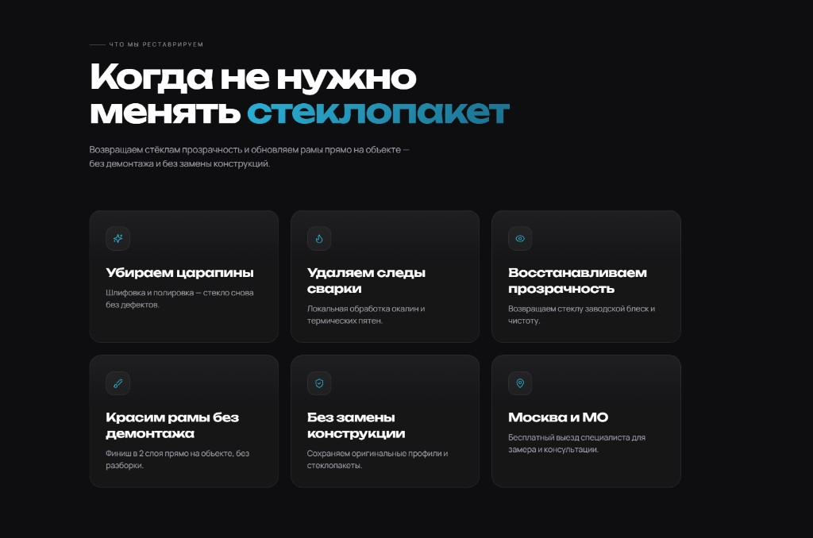
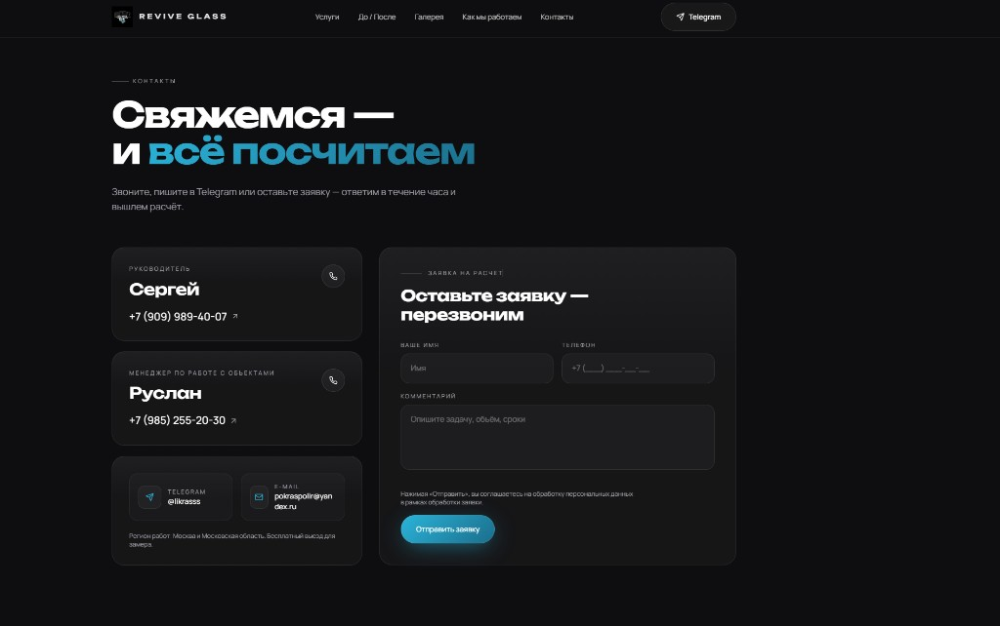
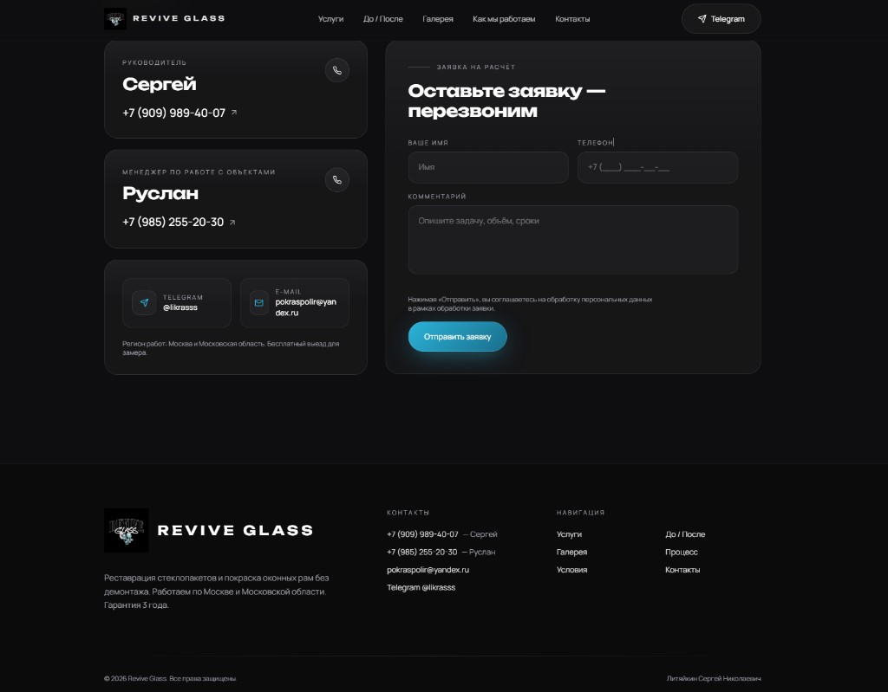

# REVIVE GLASS — сайт реставрации стеклопакетов

Премиальный лендинг для компании **Revive Glass**: покраска оконных рам и реставрация стеклопакетов **без демонтажа** — Москва и Московская область.

> Реальные фото и видео с объектов, интерактивное «До / После», галерея работ и форма заявки.

---

## Превью

### Главный экран



### Услуги



### До и После



### Галерея



### Процесс и условия

| Процесс работы | Условия сотрудничества |
|:---:|:---:|
|  |  |

### Что реставрируем · Контакты · Подвал







---

## Возможности сайта

| Раздел | Что внутри |
|--------|------------|
| **Hero** | Видеофон процесса работ, CTA «Рассчитать» / Telegram / звонок |
| **Услуги** | Покраска рам · реставрация стекла — с фото результатов |
| **До / После** | 6 кейсов, drag-слайдер «Было → Стало» |
| **Галерея** | До/После · Процесс · Готовый результат · Видео |
| **Процесс** | 5 шагов от заявки до гарантии |
| **Условия** | Смета, договор, оплата, документы для юрлиц |
| **Контакты** | Форма заявки, телефоны, Telegram, email |

---

## Стек

- **React 18** + **TypeScript**
- **Vite 5** — сборка и dev-сервер
- **Tailwind CSS** — тёмная премиальная тема
- **Framer Motion** — анимации и параллакс
- **Swiper** — карусель галереи
- **react-compare-image** — сравнение до/после

---

## Быстрый старт

```bash
# клонировать репозиторий
git clone https://github.com/volkrist/reviveglass-website.git
cd reviveglass-website

# установить зависимости
npm install

# запустить локально
npm run dev
```

Откройте в браузере: **http://localhost:5173**

### Сборка для продакшена

```bash
npm run build    # папка dist/
npm run preview  # проверка сборки на :4173
```

---

## Медиа в проекте

```
public/
├── images/
│   ├── before-after/     # 6 пар «было / стало» (case-01 … case-06)
│   ├── gallery/          # постеры для видео
│   └── pdf/              # фото бригады и фасада с объектов
└── videos/
    ├── work-process-01.mp4      # фон Hero
    ├── work-process-02.mp4      # галерея
    └── before-after-video-01.mp4  # галерея
```

Данные секций: `src/data/beforeAfter.ts`, `src/data/gallery.ts`, `src/data/services.ts`.

---

## Структура кода

```
src/
├── components/
│   ├── sections/    # Hero, Services, BeforeAfter, Gallery, Contacts…
│   └── ui/          # Container, Button, GlassCard…
├── data/            # контент и пути к медиа
└── styles/          # глобальные стили, Tailwind
```

---

## Скрипты

| Команда | Описание |
|---------|----------|
| `npm run dev` | Dev-сервер с hot reload |
| `npm run build` | TypeScript + production build |
| `npm run preview` | Просмотр сборки |
| `npm run lint` | Проверка типов |

---

## Контакты компании

- **Сергей** (руководитель): +7 (909) 989-40-07  
- **Руслан** (менеджер по объектам): +7 (985) 255-20-30  
- **Telegram:** [@likrasss](https://t.me/likrasss)  
- **Email:** pokraspolir@yandex.ru  
- **Регион:** Москва и Московская область · выезд бесплатно  

---

## Репозиторий

**GitHub:** [github.com/volkrist/reviveglass-website](https://github.com/volkrist/reviveglass-website)

---

© Revive Glass · Лендинг для презентации реальных работ компании
